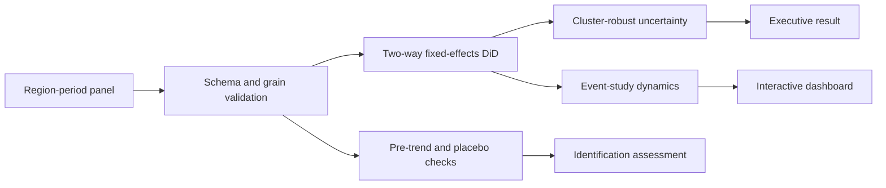

# Policy Causal Evaluation

[](https://github.com/sagarmandavkar-UX/policy-causal-evaluation/actions/workflows/tests.yml)


An end-to-end causal-inference case study for evaluating a regional policy when a randomized experiment is not possible. The repository goes beyond a regression coefficient: it validates panel structure, estimates two-way fixed-effects difference-in-differences, clusters uncertainty at the assignment unit, tests pre-trends, runs a placebo, and visualizes dynamic treatment effects.

> The bundled panel is seeded synthetic data. Results demonstrate the methodology and are not estimates for an actual government program.

## Executive result

The demo recovers an average treatment effect on treated regions of approximately **-3.10 units** with a **95% CI of -3.59 to -2.61**. The pre-period differential trend is not significant (`p ≈ 0.149`). This shows that the implementation can recover the planted effect; it does not validate a real policy claim.

## Business question

Did an intervention change an outcome in treated regions, relative to what would likely have happened without the intervention?

This structure maps naturally to healthcare expansion, labor policy, pricing changes, regional marketing rollouts, benefit programs, and operational policy changes.

## What this project demonstrates

- Causal estimand definition and identification reasoning.
- Region and period fixed effects.
- Region-clustered standard errors.
- Parallel-trends diagnostic.
- Event-study coefficients relative to a pre-policy reference period.
- Pre-policy placebo timing test.
- Explicit data-quality validation and balanced-panel checks.
- Decision-facing Streamlit dashboard and reproducible CSV/JSON outputs.

## Architecture



## Repository structure

```text
├── analysis.py              # data generator, estimators, diagnostics, exports
├── app.py                   # interactive Streamlit decision dashboard
├── docs/
│   ├── DATA_DICTIONARY.md
│   ├── EXECUTIVE_MEMO.md
│   └── METHODOLOGY.md
├── outputs/                 # reproducible estimates and panel extracts
├── test_project.py          # estimator and diagnostic tests
├── Dockerfile
├── Makefile
└── requirements.txt
```

## Quick start

```bash
git clone https://github.com/sagarmandavkar-UX/policy-causal-evaluation.git
cd policy-causal-evaluation
python -m venv .venv
source .venv/bin/activate
make setup
make analyze
make test
make dashboard
```

The dashboard opens at `http://localhost:8501` and accepts a replacement CSV.

## Input contract

One row per `region × month` with `region`, `month`, `treated`, `post`, and `outcome`. Treatment and post indicators must be binary. Duplicate region-month rows are rejected.

## Analytical safeguards

- Estimates retain 95% uncertainty intervals.
- Panel balance and duplicate keys are checked before estimation.
- Pre-treatment coefficients remain visible rather than being discarded.
- Placebo timing is estimated only on pre-policy observations.
- Documentation separates supporting diagnostics from proof of identification.

## Limitations

The example assumes a common policy date and no spillovers. A real staggered rollout requires an estimator designed for heterogeneous treatment timing. Real analysis should also address policy anticipation, concurrent shocks, outcome-definition changes, missing observations, and alternative comparison groups.

## Portfolio talking points

- Built a dependency-light DiD estimator with two-way fixed effects and region-clustered inference.
- Designed an event-study and placebo workflow to test identifying assumptions instead of reporting only a p-value.
- Translated model output into an executive memo and interactive decision dashboard.

See [Methodology](docs/METHODOLOGY.md), [Data dictionary](docs/DATA_DICTIONARY.md), and [Executive memo](docs/EXECUTIVE_MEMO.md).
